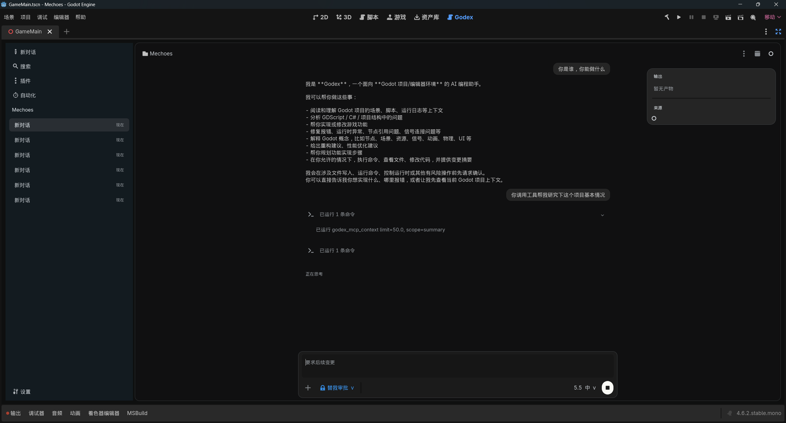
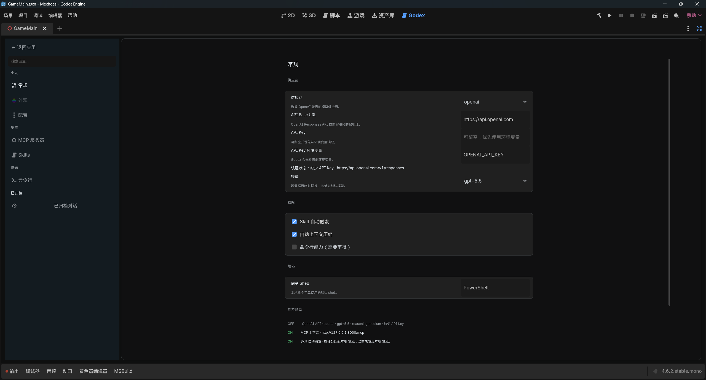

# Godex

<p align="center"><a href="README.md">English</a> | <a href="README.zh-CN.md">简体中文</a></p>

> [!WARNING]
> Godex is in a very, very early `0.0.0` archive state. The core agent features are still not usable as a real product.

> [!NOTE]
> A later version is expected to move to a new repository and replace the current GDScript-only backend with the Codex runtime / app-server architecture.

Godex is an experimental Godot 4.x editor plugin. It records the process of exploring a Codex-like AI workbench inside the Godot editor, and it serves as a real project case for validating that Godot .NET MCP can support large, long-running editor automation work.

> [!TIP]
> Fun fact: building even this half-finished skeleton of a half-finished project has already consumed more than 2000M of the author's tokens.

This repository is mainly useful as:

- a development log for a Godot-native AI assistant experiment;
- a project-scale stress test and showcase for Godot .NET MCP;
- a place to discover missing capabilities, rough edges, and improvement ideas for Godot .NET MCP.





## What It Is

Godex tries to bring a Codex-inspired workflow into Godot: a left conversation rail, a central transcript, a bottom composer, settings, approvals, MCP context, tool-call rows, and long-running development records. It is not production ready, and many parts are still prototypes.

## Architecture

Godex is built as a standalone Godot editor plugin. The current backend is fully implemented in GDScript, without a separate native server or WebView app.

The structure is intentionally simple:

1. `addons/godex/plugin.gd` owns the Godot plugin lifecycle and registers the `Godex` main screen.
2. `addons/godex/ui/godex_main.tscn`, `godex_dock_controller.gd`, and `godex_theme.gd` implement the Godot-native UI with `Control` and `Container` nodes.
3. `addons/godex/core/godex_state.gd`, `session_store.gd`, and `settings_store.gd` keep sessions, messages, model events, tool calls, approvals, goals, settings, and local JSON persistence under `user://godex`.
4. `agent_service.gd`, `openai_request_builder.gd`, `openai_execution_service.gd`, `mcp_client.gd`, `command_capability.gd`, and `approval_policy.gd` model the current Agent loop, OpenAI-compatible requests, MCP tool calls, command permissions, and approval rules.

The intended flow is:

`composer input -> state -> agent service -> OpenAI request -> response/tool calls -> MCP or command boundary -> tool result -> continuation`

The design target is Codex-like semantics: tool calls should update in place, a turn should continue through tool-result follow-up instead of using a small fixed step script, and future subagents should be real child Agent/thread work rather than ordinary chat lines.

## Validation

The project has been developed while installed into a larger Godot project and repeatedly validated through Godot .NET MCP. That large-project feedback loop is the main reason this repository exists.

Basic local smoke validation:

```powershell
powershell -ExecutionPolicy Bypass -File tools/validate-godex.ps1 -GodotPath "E:/Program Files/Godot_v4.6.2-stable_mono_win64/Godot_v4.6.2-stable_mono_win64_console.exe"
```

## License

Godex is licensed under the PolyForm Noncommercial License 1.0.0. See [LICENSE](LICENSE).
